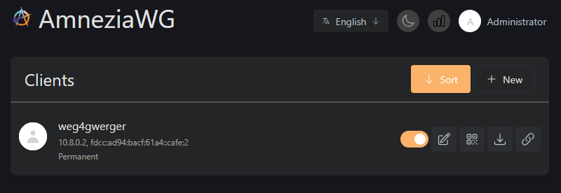
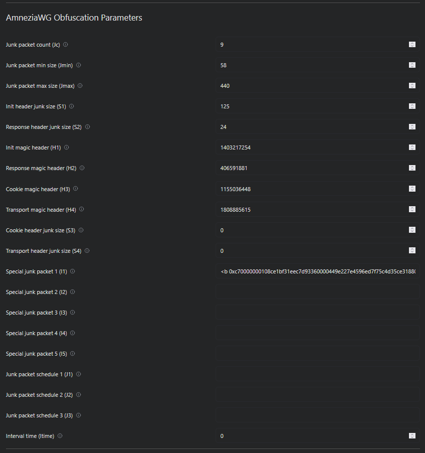

# AmneziaWG Easy

---

> [!IMPORTANT]
>
> The container does not use the Go implementation! It is mandatory to install the AmneziaWG kernel module on the host system.
>
> Instructions for installing the module: [amneziawg-linux-kernel-module](https://github.com/amnezia-vpn/amneziawg-linux-kernel-module)
>
> Instructions for the correct installation of the module on Ubuntu 24.x and higher: [amneziawg-linux-kernel-module for Ubuntu 24.x](docs/content/guides/ubuntu24.md)

> [!IMPORTANT]
>
> Контейнер не использует реализацию на Go! Для работы обязательно требуется установить модуль ядра AmneziaWG на хост-систему.
>
> Инструкция по установке модуля: [amneziawg-linux-kernel-module](https://github.com/amnezia-vpn/amneziawg-linux-kernel-module)
>
> Инструкция по правильной установке модуля на Ubuntu 24.x и выше: [amneziawg-linux-kernel-module for Ubuntu 24.x](docs/content/guides/ubuntu24ru.md)

[](https://github.com/evoll/awg-easy/actions/workflows/deploy.yml)
[](https://github.com/evoll/awg-easy/actions/workflows/lint.yml)
[](https://github.com/evoll/awg-easy/stargazers)
[](LICENSE)
[](https://github.com/evoll/awg-easy/releases/latest)
[](https://github.com/evoll/awg-easy/pkgs/container/awg-easy)

You have found the easiest way to install & manage AmneziaWG on any Linux host!

<!-- TOOD: update screenshot -->
[](./assets/screenshot.png "awg-easy Screenshot")
[](./assets/screenshot2.png "awg-easy Screenshot2")

## AmneziaWG Support 
- AmneziaWG obfuscation parameters support (Jc, Jmin, Jmax, S1-S4, H1-H4, I1-I5, J1-J3, Itime)
- Parameter constraints validation and random generation on first run, every install will be unique
- Adaptive UI theme that detects AmneziaWG vs WireGuard and switches branding accordingly
- Automatic fallback to standard WireGuard when AmneziaWG kernel module is not available

This project is a fork of [wg-easy](https://github.com/wg-easy/wg-easy)

## Features
- All-in-one: AmneziaWG + Web UI.
- Easy installation, simple to use.
- List, create, edit, delete, enable & disable clients.
- Show a client's QR code.
- Download a client's configuration file.
- Statistics for which clients are connected.
- Tx/Rx charts for each connected client.
- Gravatar support.
- Automatic Light / Dark Mode
- Multilanguage Support
- One Time Links
- Client Expiration
- Prometheus metrics support
- IPv6 support
- CIDR support
- 2FA support

> [!NOTE]
> To better manage documentation for this project, it has its own site here: [https://evoll.github.io/awg-easy/latest](https://evoll.github.io/awg-easy/latest)

- [Getting Started](https://evoll.github.io/awg-easy/latest/getting-started/)
- [Basic Installation](https://evoll.github.io/awg-easy/latest/examples/tutorials/basic-installation/)
- [Caddy](https://evoll.github.io/awg-easy/latest/examples/tutorials/caddy/)
- [Traefik](https://evoll.github.io/awg-easy/latest/examples/tutorials/traefik/)
- [Podman](https://evoll.github.io/awg-easy/latest/examples/tutorials/podman-nft/)
- [AdGuard Home](https://evoll.github.io/awg-easy/latest/examples/tutorials/adguard/)

> [!NOTE]
> If you want to migrate from the old version to the new version, you can find the migration guide here: [Migration Guide](https://evoll.github.io/awg-easy/latest/advanced/migrate/)

## Installation

This is a quick start guide to get you up and running with AmneziaWG Easy.

For a more detailed installation guide, please refer to the [Getting Started](https://evoll.github.io/awg-easy/latest/getting-started/) page.

### 1. Install Docker

If you haven't installed Docker yet, install it by running as root:

```shell
curl -sSL https://get.docker.com | sh
exit
```

And log in again.

### 2. Run AmneziaWG Easy

The easiest way to run AmneziaWG Easy is with Docker Compose.

Just follow [these steps](https://evoll.github.io/awg-easy/latest/examples/tutorials/basic-installation/) in the detailed documentation.

You can also install AmneziaWG Easy with the [docker run command](https://evoll.github.io/awg-easy/latest/examples/tutorials/docker-run/) or via [podman](https://evoll.github.io/awg-easy/latest/examples/tutorials/podman-nft/).

Now [setup a reverse proxy](https://evoll.github.io/awg-easy/latest/examples/tutorials/basic-installation/#setup-reverse-proxy) to be able to access the Web UI securely from the internet. This step is optional, just make sure to follow the guide [here](https://evoll.github.io/awg-easy/latest/examples/tutorials/reverse-proxyless/) if you decide not to do it.

## Donate

Are you enjoying this project? Consider donating.

Founder: [Buy Emile a beer!](https://github.com/sponsors/WeeJeWel) 🍻

Maintainer: [Buy kaaax0815 a coffee!](https://github.com/sponsors/kaaax0815) ☕

## Development

### Prerequisites

- Docker
- Node LTS & corepack enabled
- Visual Studio Code

### Dev Server

This starts the development server with docker

```shell
pnpm dev
```

### Update Auto Imports

If you add something that should be auto-importable and VSCode complains, run:

```shell
cd src
pnpm install
cd ..
```

### Test Cli

This starts the cli with docker

```shell
pnpm cli:dev
```

## License

This project is licensed under the AGPL-3.0-only License - see the [LICENSE](LICENSE) file for details

This project is not affiliated, associated, authorized, endorsed by, or in any way officially connected with Jason A. Donenfeld, ZX2C4 or Edge Security

"WireGuard" and the "WireGuard" logo are registered trademarks of Jason A. Donenfeld
